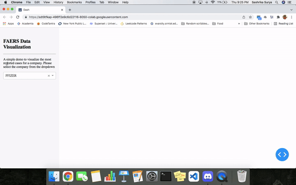

# Visualizer for TigerGraph

This repository contains a simple demo for utilising TigerGraph-Dash-Class. 

It utilises the Healthcare Graph (Drug Interaction/FAERS) and visualizes the most reported drugs for the selected company using a bar graph. 

## Set Up
- Follow the steps in tigergraph [demo](https://tigergraph-devlabs.github.io/tg-dash-class/quick/01_notes/) and create a solution using the Healthcare Graph (Drug Interaction/FAERS).
- Create login details and update the same in the notebook in the TG_USERNAME and TG_PASSWORD fields. 
- Load in the data and queries in GraphStudio
- Run the notebook

## Demo

## To-do
- [ ] Finish streamlit frontend
- [ ] Integrate the model with a flutter app
- [ ] Improve accuracy for distance measurement

## Contributor
- [Sashrika Surya](https://github.com/sashrika15)

